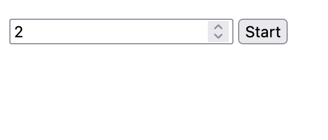
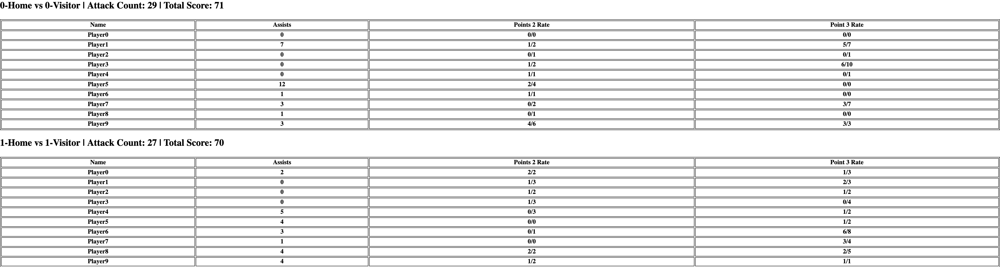

# NBA Games

This project is built to simulate NBA games and provide real-time updates about the on going matches.

## General Structure

`Real world is parallel`. Because of this and to simulate the game;

- every player is a goroutine
- every match is a goroutine
- every week is a goroutine
- the ball is a goroutine
- score board is a goroutine

During the game, every player (goroutines) are after the ball. They cannot do anything unless they have the ball. This
way a synchronization is sustained among the players.

Once a player obtains the ball he either shoots or passes it. This action and success chance of this action is
determined randomly.

Based on the action, relevant statistics are updated and queried for the scoreboard.

## Setup

Make sure you have `go` installed on the host. (This project was developed with go 1.17). To build simply issue the
following command:

```
go build
```

## Running

After building run the resulting binary. The application will be available on `localhost:8080`. From here you can enter
the number of matches to run and monitor them from the score boards.

## Screenshots

- Start screen:
    - 
- Score Boards:
    - 

## Resources

- https://github.com/gorilla/websocket/blob/master/examples/echo/server.go
- https://gowebexamples.com/templates/
- https://golang.org
- https://gobyexample.com/

